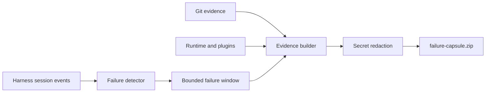

# dsh-failure-capsule

DeepSeek Harness 的本地优先故障证据包插件：当工具或 Agent 失败时，自动把**失败前发生了什么、项目当时是什么状态、运行环境和插件组合是什么**整理成一个经过脱敏的 ZIP。

[English](README.en.md)

[](https://www.npmjs.com/package/dsh-failure-capsule)
[](https://github.com/YiHarvest/dsh-failure-capsule/actions/workflows/ci.yml)
[](LICENSE)
[](https://github.com/deepseek-ai/deepseek-harness)

> **当前状态：** 可作为标准 Profile Bundle 安装；面向 `@deepseek-ai/dsh@0.1.0-rc.6` 的原生 `session/event` 与 `agent/error` 接口实现。插件不修改 Harness 核心，不上传数据，也不调用模型诊断故障。

## 快速开始

为使用中的 profile 安装插件。Web 与 headless 是两个独立 profile，需要分别安装：

```sh
dsh plugin --profile web add dsh-failure-capsule
dsh plugin --profile headless add dsh-failure-capsule
```

验证组合层：

```sh
dsh --profile web --dump-config
# 输出中应出现 id: failure-capsule / name: dsh-failure-capsule
```

随后正常使用 DSH。失败发生时，插件默认把证据包写入当前项目：

```text
.dsh/failure-capsules/
└── 2026-08-14T08-20-31-123Z_<session>_tool-error_event-42.zip
```

## 它解决什么问题

普通错误日志往往只有“最后哪里炸了”，但 Coding Agent 的失败通常依赖一整段过程：模型请求、工具调用、权限、工作树变化、运行时以及插件组合。Failure Capsule 把这些信号放在同一个离线证据包里：



默认捕获以下故障：

| 信号 | 默认 | 说明 |
|---|---:|---|
| `tool/result` 且 `isError=true` | ✅ | 每个失败工具调用各生成一份 |
| `turn/end` / `error` | ✅ | 模型、传输或 Agent 回合失败 |
| `turn/end` / `blocked` | ✅ | 回合被策略或流程阻塞 |
| `turn/end` / `interrupted` | ✅ | 上个进程未能正常关闭回合 |
| `agent/error` | ✅ | 没有落入持久化失败回合的运行时错误 |
| `turn/end` / `aborted` | ❌ | 用户取消默认不视为故障，可配置开启 |

## ZIP 内容

```text
failure-capsule.zip
├── manifest.json              # schema、触发点、证据清单、脱敏计数
├── failure.json               # 结构化失败身份
├── timeline.jsonl             # 失败点之前的有界 Session Event 窗口
├── diagnosis.md               # 确定性、无模型的排查入口
├── runtime.json               # Node / OS / 项目包信息
├── plugins.json               # Loader 插件、启用状态和 fiber 阶段
├── redaction-report.json      # 按规则统计；不包含原始秘密
├── session/
│   └── header.json            # 会话 cwd、谱系和格式版本
└── git/
    ├── head.txt
    ├── branch.txt
    ├── status.txt
    ├── recent-commits.txt
    ├── working-tree.patch
    └── index.patch
```

Timeline 默认最多 80 条事件。每条 Git 命令默认最多采集 512 KiB；达到预算会终止命令并明确标注截断。Git 通过参数数组直接执行，不经过 shell，不读取未跟踪文件内容，也不运行 hook 或 textconv。

## 安全模型

- **Local-first：** ZIP 只写本机；插件没有网络请求和遥测后端。
- **导出副本脱敏：** 原始 Session Log 和工作树不被改写。
- **默认脱敏：** 敏感字段、Bearer/Basic 凭据、常见 provider/GitHub/npm token、AWS access key、环境变量赋值、URL 用户密码、私钥块和本机路径。
- **有界采集：** Session Event 数量和每个 Git 输出都有硬上限。
- **错误隔离：** 证据生成失败只写 Harness warning，不改变 Agent 的原始失败或后续运行。
- **安全停止：** 插件卸载时会等待已启动的证据包写入结束。

> 自动脱敏不能证明 ZIP 中绝对没有业务秘密。分享前仍应人工检查，尤其是自由文本、源代码 diff 和自定义插件事件。

## 配置

`cordis.patch.yml` 提供以下默认值。可以在 profile 的 `cordis.patch.yml` 中用同一个 row id 覆盖整段配置：

```yaml
- id: failure-capsule
  name: dsh-failure-capsule
  config:
    outputDir: .dsh/failure-capsules
    maxEvents: 80
    maxGitBytes: 524288
    captureGit: true
    capturePlugins: true
    triggerOnToolError: true
    triggerOnTurnFailure: true
    triggerOnAborted: false
    triggerOnAgentError: true
```

| 字段 | 类型 | 默认值 | 作用 |
|---|---|---:|---|
| `outputDir` | string | `.dsh/failure-capsules` | 相对路径以 Session cwd 为基准；也可用绝对路径 |
| `maxEvents` | integer | `80` | `1..10000`，失败点之前最多保留的事件数 |
| `maxGitBytes` | integer | `524288` | `1024..16777216`，每条 Git 命令的输出预算 |
| `captureGit` | boolean | `true` | 是否采集 Git 证据 |
| `capturePlugins` | boolean | `true` | 是否采集 Loader 插件清单 |
| `triggerOnToolError` | boolean | `true` | 失败工具结果是否触发 |
| `triggerOnTurnFailure` | boolean | `true` | error / blocked / interrupted 回合是否触发 |
| `triggerOnAborted` | boolean | `false` | aborted 回合是否触发 |
| `triggerOnAgentError` | boolean | `true` | 无持久化失败边界的 live error 是否触发 |

错误配置在插件加载时直接失败，不静默回退。相同 Session Event 在一个插件生命周期内只生成一次；`agent/error` 会短暂等待对应的 `turn/end`，避免同一失败重复打包。

## 开发与验证

需要 Node `^22.19.0 || >=24.0.0`：

```sh
npm install
npm run check
npm pack
```

测试覆盖脱敏、故障分类、配置边界、Git 采集预算、ZIP 确定性、原子写入和路径安全。发布包的 `prepack` 会重新执行 typecheck、测试与构建。

从本地 tarball 验证真实 profile 安装：

```sh
npm pack
dsh plugin --profile web add ./dsh-failure-capsule-0.1.0.tgz
dsh --profile web --dump-config
```

## 生态发现

仓库使用 `dsh-plugin` topic，并以 `package.json` 的 `dsh.bundle.patch` 作为标准安装入口，因此会被 [Awesome DSH Plugins Radar](https://github.com/AdamPlatin123/awesome-dsh-plugins) 自动发现。收录只代表可发现；兼容性和安全性仍应以可复现测试与源码审查为准。

## 许可

[MIT](LICENSE)
