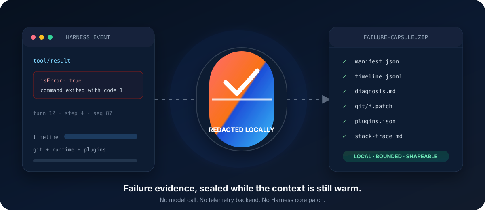

<div align="center">

# dsh-failure-capsule

**在上下文消失之前，封存失败证据。**

一个本地优先的 DeepSeek Harness 插件，把失败的 Agent 工作整理成经过脱敏、可审阅的证据 ZIP。

[](https://www.npmjs.com/package/dsh-failure-capsule)
[](https://github.com/YiHarvest/dsh-failure-capsule/actions/workflows/ci.yml)
[](https://github.com/deepseek-ai/deepseek-harness)
[](LICENSE)

[npm](https://www.npmjs.com/package/dsh-failure-capsule) · [GitHub Packages](https://github.com/users/YiHarvest/packages?repo_name=dsh-failure-capsule) · [更新记录](CHANGELOG.md) · [English](README.en.md)

</div>

> **发布状态：** 当前源码是标准 Profile Bundle，已针对 DeepSeek Harness `@deepseek-ai/dsh@0.1.5-rc.2` 验证。它通过原生 `session/event`、`agent/error` 和 Loader inventory 接口工作，不修改 Harness 核心。采集只在本地进行，不调用模型，也没有遥测后端。



## 体验当前版本

Web 和 headless 是彼此独立的 profile。需要在哪个 profile 捕获失败，就在哪个 profile 安装：

```bash
dsh plugin --profile web add dsh-failure-capsule
dsh plugin --profile headless add dsh-failure-capsule
```

同一版本也会以 `@yiharvest/dsh-failure-capsule` 发布到 GitHub Packages。先使用具备 `read:packages` 权限的 classic personal access token 登录，再安装 scoped bundle：

```bash
npm login --scope=@yiharvest --auth-type=legacy --registry=https://npm.pkg.github.com
dsh plugin --profile web add @yiharvest/dsh-failure-capsule
```

确认组合层已经生效：

```bash
dsh --profile web --dump-config
# 查找：id: failure-capsule / name: dsh-failure-capsule
```

安装后不需要运行额外命令。继续正常使用 Harness；匹配的失败会在 Session 工作目录下写入证据包：

```text
.dsh/failure-capsules/
└── 2026-08-31T01-23-45-678Z_<session>_tool-error_event-87.zip
```

## 核心想法

最后一行报错通常解释不了 Agent 为什么失败。真正有用的上下文散落在此前的工具调用、回合边界、仓库状态、运行环境、活动插件里，有时还藏在一段压缩后的 JavaScript 栈中。

Failure Capsule 会在这些上下文仍然存在时把它们保存下来：

1. 监听 Harness 原生的持久化或实时失败信号。
2. 截取有界的 Session 与环境证据窗口。
3. 存在 JavaScript 栈时，使用本地 source map 还原源码位置。
4. 只对导出副本中的凭据、本机路径和敏感字段进行脱敏。
5. 写出一份确定性、自带索引、便于审阅或分享的 ZIP。

## 为什么还需要一个调试工具？

| 工具类别 | 通常保留什么 | Failure Capsule 补充什么 |
|---|---|---|
| 终端输出 | 最后一条命令及其 stderr | 导致失败的 Agent 时间线 |
| Harness Session Log | 持久化交互事件 | Git、运行时、插件清单、排查入口和单一便携归档 |
| 错误追踪平台 | 上传到后端的异常 | 无需服务或账号的本地采集 |
| Harness 核心埋点补丁 | 产品内部状态 | 建立在公开扩展点上的可移除 Profile Bundle |
| **Failure Capsule** | **一次失败工具调用或失败回合** | **故障发生时的一份有界、脱敏证据包** |

它不是错误追踪平台、日志上传器或 AI 诊断服务。它负责准备人或其他工具进行调查所需的证据。

## 保持启用

Profile 安装是持久的，但各 profile 彼此独立。在 `web` 安装不会自动为 `headless` 启用，反之亦然。

默认触发范围经过刻意收敛：

| 信号 | 默认 | 结果 |
|---|---:|---|
| 失败的 `tool/result` | 开 | 每次失败工具调用生成一份 capsule |
| `turn/end` / `error` | 开 | 捕获模型、传输或 Agent 回合失败 |
| `turn/end` / `blocked` | 开 | 捕获策略或工作流阻塞 |
| `turn/end` / `interrupted` | 开 | 捕获被先前进程遗留为未闭合的回合 |
| 没有持久化失败回合的实时 `agent/error` | 开 | 捕获否则会消失的运行时错误 |
| `turn/end` / `aborted` | 关 | 用户取消只有显式启用后才会捕获 |

同一事件在插件生命周期内只处理一次。实时 `agent/error` 会短暂等待相应的持久化 `turn/end`，避免同一次失败生成两个归档。

## 使用当前插件

这个 bundle 是常驻观察型插件：安装、按需配置，然后使用普通解压和文本工具检查生成的 ZIP。

```bash
# 从 npm 安装
dsh plugin --profile web add dsh-failure-capsule

# 或在 npm login 后从 GitHub Packages 安装 scoped 版本
dsh plugin --profile web add @yiharvest/dsh-failure-capsule

# 验证最终组合配置
dsh --profile web --dump-config

# 测试尚未发布的本地构建
npm pack
dsh plugin --profile web add ./dsh-failure-capsule-0.2.4.tgz
```

相对输出路径以 Session 工作目录为基准；也可以使用绝对路径。

## 当前源码提供什么

| 已交付能力 | 发布证据 |
|---|---|
| Harness `0.1.5-rc.2` 兼容性 | 针对已发布 Agent/Session contracts 的类型检查、真实 Cordis 集成测试，以及打包安装后的 DSH profile 启动测试 |
| 工具失败、回合失败、中断、阻塞和实时 Agent 错误触发 | 聚焦的分类与生命周期测试 |
| 有界时间线、Git、运行时和插件证据 | 确定性 ZIP 断言与命令预算测试 |
| 本地 source map 解析 | 栈帧解析、映射、缺失映射与大小限制测试 |
| 凭据与路径脱敏 | 规则级脱敏测试和归档级断言 |
| 原子写入与卸载排空 | 文件系统和插件销毁集成覆盖 |

归档 schema 仍为版本 `1`。运行时直接从 `session/event` 维护有界窗口，因此采集不再依赖同步读取完整 Session 历史。CI 还会以非阻塞 canary 检查最新发布的 Harness alpha，但不会把预发布版纳入正式支持依赖基线。

## Capsule 如何工作

`session/event` 是持久化事实来源。失败工具结果与终止回合原因可以立即触发；`agent/error` 则用于兜底捕获没有生成持久化失败回合记录的实时错误。

插件启用期间，会为每个观察到的 Session 最多保留 `maxEvents` 条持久化事件。触发时，插件会分离该有界窗口与当前 Session header、记录 Loader inventory，并执行有界、只读的 Git 命令。如果在一个已经运行的 Session 中途启用插件，它不会同步回填更早的历史。它不会读取未跟踪文件内容，不经过 shell，不运行 Git hook，也不启用 textconv。每条 Git 命令都有独立输出预算。

如果失败携带 JavaScript 栈，插件会解析栈帧并查找相邻的本地 source map。映射文件读取有字节上限，且永不访问网络。归档同时保留结构化栈帧，以及带可用源码上下文的 Markdown 版本。

所有证据都在组装 ZIP 前经过脱敏。原始 Session Log、仓库和错误栈不会被改写。

## 发布路线

当前版本聚焦于忠实的本地采集和稳定的证据格式。后续工作在公开 [Issue Tracker](https://github.com/YiHarvest/dsh-failure-capsule/issues) 中跟踪；可能的方向包括更丰富的失败关联、更多证据适配器，以及不削弱本地优先安全模型的阅读工具。

兼容性声明必须对应可复现测试和明确的 Harness 版本。未来的 Harness 预发布版只有在本包完成验证后才会列入支持范围。

## 隐私

Failure Capsule 没有网络客户端和遥测后端。正常运行时只读取本地 Session 状态、Loader 元数据、选定的运行时信息、本地 source map 和有界 Git 输出，然后把 ZIP 写入配置的本地目录。

导出副本会脱敏：

- 敏感对象字段和环境变量赋值；
- Bearer 与 Basic 授权值；
- 常见 provider、GitHub、npm 与 AWS 凭据形式；
- URL 中嵌入的凭据；
- 私钥块；
- 本机 home 目录路径。

脱敏报告只包含按规则统计的数量，从不保存匹配到的秘密。脱敏是纵深防御，不能证明任意源码 diff 或自由文本中绝对不存在业务秘密。把 capsule 分享到原信任范围之外前，请先人工检查。

采集限制同时保护 Agent 循环和最终产物。默认时间线最多 80 条事件，每条 Git 命令最多 512 KiB，单个 source map 最多读取 4 MiB。采集失败只产生 Harness warning，不会替换原始 Agent 错误。

## 配置

在后续 profile patch 中用相同 id 覆盖 bundle row：

```yaml
- id: failure-capsule
  name: dsh-failure-capsule
  config:
    outputDir: .dsh/failure-capsules
    maxEvents: 80
    maxGitBytes: 524288
    captureGit: true
    capturePlugins: true
    triggerOnToolError: true
    triggerOnTurnFailure: true
    triggerOnAborted: false
    triggerOnAgentError: true
    resolveSourceMaps: true
    maxSourceMapBytes: 4194304
```

| 字段 | 默认值 | 接受范围 |
|---|---:|---|
| `outputDir` | `.dsh/failure-capsules` | 非空相对或绝对路径，不得包含 NUL |
| `maxEvents` | `80` | `1..10000` 的整数 |
| `maxGitBytes` | `524288` | `1024..16777216` 的整数 |
| `captureGit` | `true` | 布尔值 |
| `capturePlugins` | `true` | 布尔值 |
| `triggerOnToolError` | `true` | 布尔值 |
| `triggerOnTurnFailure` | `true` | 布尔值 |
| `triggerOnAborted` | `false` | 布尔值 |
| `triggerOnAgentError` | `true` | 布尔值 |
| `resolveSourceMaps` | `true` | 布尔值 |
| `maxSourceMapBytes` | `4194304` | `1024..67108864` 的整数 |

无效配置会让插件加载失败，不会静默改变行为。

## Capsule 内容

```text
failure-capsule.zip
├── manifest.json              schema、触发点、文件索引与脱敏统计
├── failure.json               结构化失败身份
├── timeline.jsonl             截止失败点的有界事件窗口
├── diagnosis.md               确定性、无模型的排查入口
├── runtime.json               Node、OS、架构与项目包信息
├── plugins.json               Loader 条目、启用状态与 fiber 阶段
├── redaction-report.json      安全的规则替换计数
├── stack-trace.json           可用时的解析与源码映射栈帧
├── stack-trace.md             可读栈帧与源码上下文
├── session/header.json        Session cwd、谱系与格式版本
└── git/
    ├── head.txt
    ├── branch.txt
    ├── status.txt
    ├── recent-commits.txt
    ├── working-tree.patch
    └── index.patch
```

## 参与贡献

需要 Node `^22.19.0 || >=24.0.0`。本地验证命令：

```bash
npm install
npm run check
npm pack --dry-run
```

`npm run check` 会执行严格类型检查、单元与集成测试、生产构建，以及真实的打包安装 DSH profile E2E。创建包前，`prepack` 会重复同一组检查。

## 许可证

[MIT](LICENSE) © 2026-present [YiHarvest](https://github.com/YiHarvest)
LINUX DO: https://linux.do/latest
